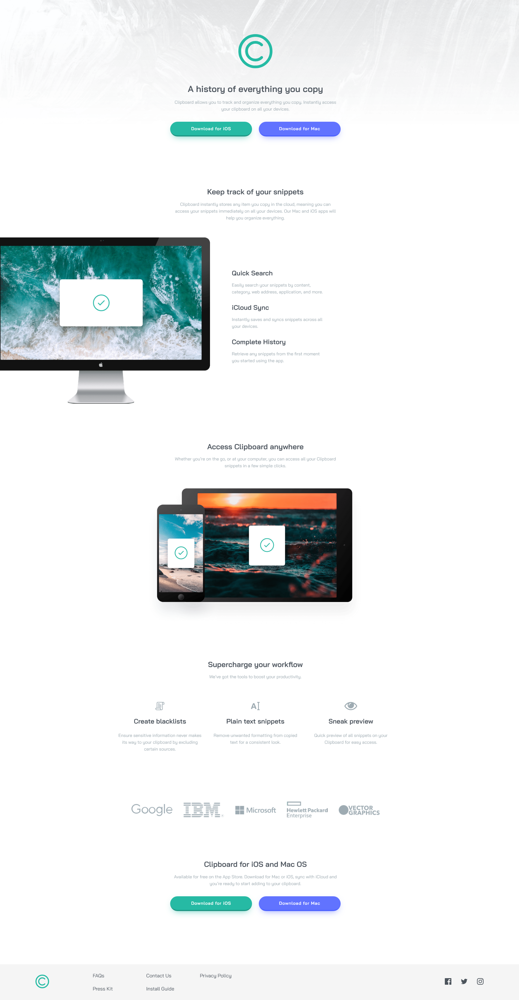

# Frontend Mentor - Clipboard landing page solution

This is a solution to the [Clipboard landing page challenge on Frontend Mentor](https://www.frontendmentor.io/challenges/clipboard-landing-page-5cc9bccd6c4c91111378ecb9). Frontend Mentor challenges help you improve your coding skills by building realistic projects. 

## Table of contents

- [Overview](#overview)
  - [The challenge](#the-challenge)
  - [Screenshot](#screenshot)
  - [Links](#links)
- [My process](#my-process)
  - [Built with](#built-with)
  - [What I learned](#what-i-learned)
  - [Continued development](#continued-development)
  - [Useful resources](#useful-resources)
- [Author](#author)


## Overview

### The challenge

Users should be able to:

- View the optimal layout for the site depending on their device's screen size
- See hover states for all interactive elements on the page

### Screenshot



### Links

- Solution URL: [Add solution URL here](https://your-solution-url.com)
- Live Site URL: [Add live site URL here](https://your-live-site-url.com)

## My process

### Built with

- Semantic HTML5 markup
- CSS custom properties
- Flexbox
- CSS Grid
- Mobile-first workflow

### What I learned

Finally learned how to change de color of a SGV on a hover, by targeting the tag 'path'. Also improved my positioning techniques, merging the diferent displays and positions to get the result expected. And particularly proud of the solution to the section with items texts and paragraphs.

```html
<section class="blocks-section">
      <div class="blocks-header">
        <h2>Supercharge your workflow</h2>
        <p>We’ve got the tools to boost your productivity.</p>
      </div>

      <div class="block-items">
        <div class="block-item">
          
          <h3>Create blacklists</h3>
          <p>Ensure sensitive information never makes its way to your clipboard by excluding certain sources.</p>
        </div>

        <div class="block-item">
          
          <h3>Plain text snippets</h3>
          <p>Remove unwanted formatting from copied text for a consistent look.</p>
        </div>

        <div class="block-item">
          
          <h3>Sneak preview</h3>
          <p>Quick preview of all snippets on your Clipboard for easy access.</p>
        </div>
      </div>
    </section>
```
```css
svg path:hover {
    stroke: var(--strong-cyan);
    fill: var(--strong-cyan);
    transition: all 500ms ease-in-out;
}
```

### Continued development

Looking foward to improve even more my flex domain, to build a responsive layout, and also position better my elements, without using margin that much.

### Useful resources

- [Grid Quick Guide](https://css-tricks.com/snippets/css/complete-guide-grid/) - Always help me remembering grid semantics and properties. 
- [Flexbox Quick Guide](https://css-tricks.com/snippets/css/a-guide-to-flexbox/) - Always help me remembering Flexbox semantics and properties. 
- [Box Shadow Generator](https://html-css-js.com/css/generator/box-shadow/) - This one is essential for my shadow analysis.

## Author

- Frontend Mentor - [@jAllanOli](https://www.frontendmentor.io/profile/jAllanOli)
- gitHub - [@jAllanOli](https://github.com/jAllanOli)